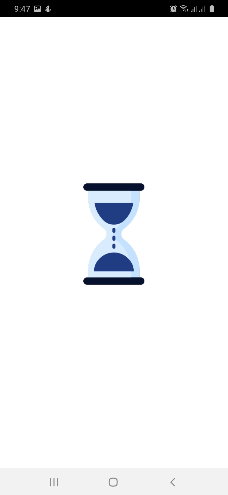
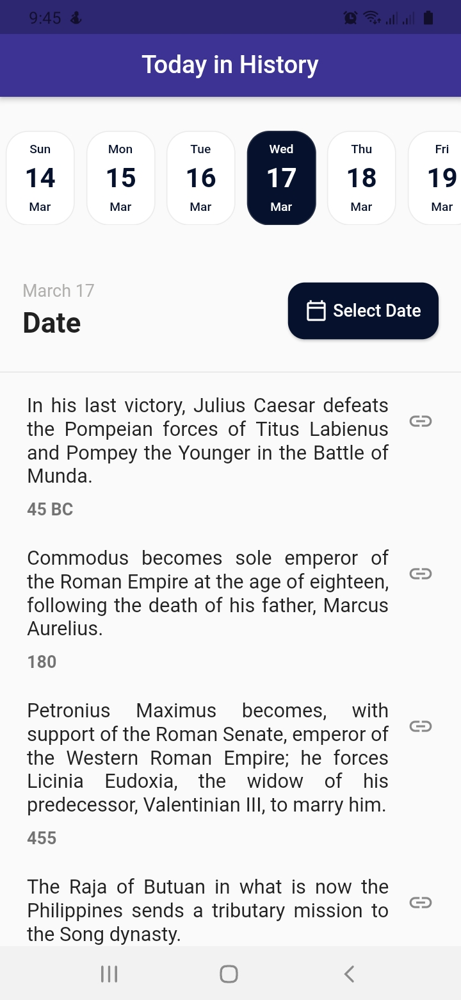
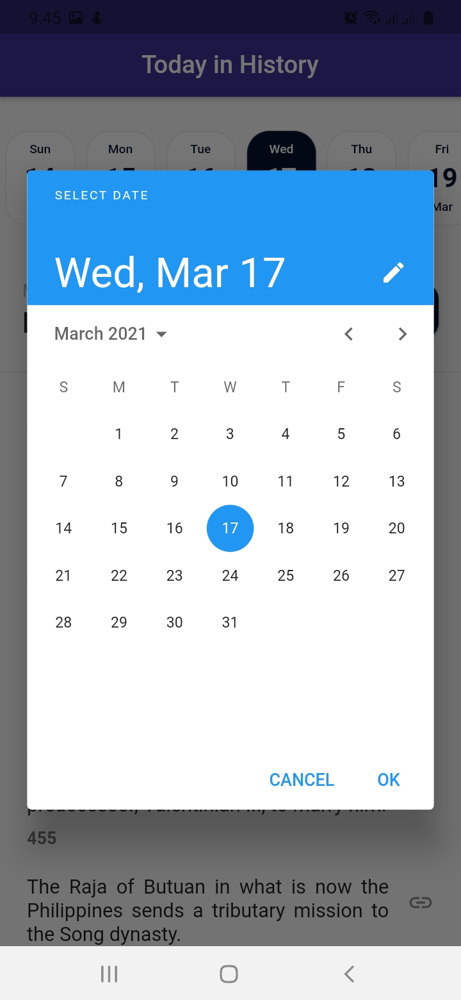

# 🔥🔥 Today In History Flutter  App  
Today In History

<a href="https://play.google.com/store/apps/details?id=com.imef.today_in_history"></img></a>
## ✨ Libraries & Techs used
* Flutter bloc (state management)
* Clean  Architecture 
* Shared Preferences
* get_it (dependency injection)
* data_connection_checker
* http
* mockito
* TDD

Star⭐ the repo if you like what you see😉.

## 📸 ScreenShots

    

## 🤓 Author(s)
**Femi Bolaji** 

